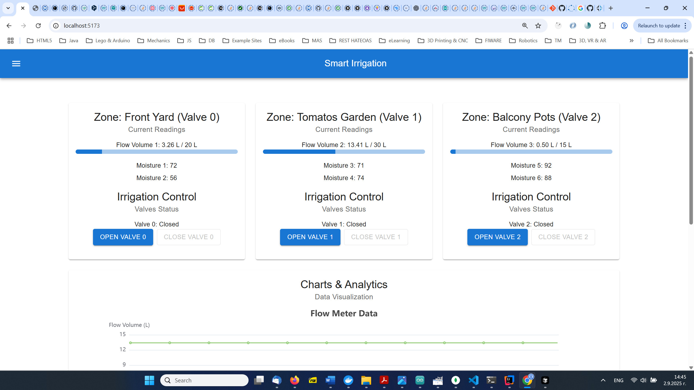
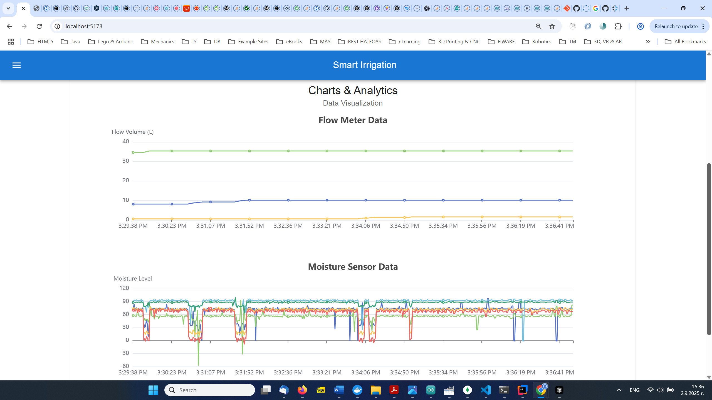

# IPT - Intellectual Products &amp; Technologies [ https://iproduct.org ] Smart Irrigation Project


## Smart Irrigation Dashboard (React Client)

### Project Description

This project is the React client for a Smart Irrigation system. It provides a dashboard for monitoring sensor data (flow, moisture, temperature, humidity), controlling irrigation valves, and managing irrigation zones. The client communicates with a backend API via WebSockets for real-time data and REST API for zone management.





### React Client Overview

The client application is built using React with TypeScript and utilizes the Material-UI component library for a modern and responsive user interface. It features:

*   **Real-time Sensor Data**: Displays live data from flowmeters and moisture sensors, including calculated water volume.
*   **Irrigation Control**: Allows individual control of irrigation valves through a WebSocket connection.
*   **Zone Management**: A dedicated page for CRUD (Create, Read, Update, Delete) operations on irrigation zones, interacting with a backend REST API.
*   **Historical Data Visualization**: Uses Echarts to display historical flow volume and moisture sensor data in separate, resizable charts.
*   **Responsive Design**: The dashboard is designed to adapt to various screen sizes.

### Setup and Installation

To set up and run the React client application locally, follow these steps:

#### Prerequisites

*   Node.js (LTS version recommended)
*   npm (Node Package Manager)
*   A running backend API for zone management and WebSocket server for sensor data (e.g., at `http://192.168.0.17:8080`).

#### Installation Steps

1.  **Clone the repository (if you haven't already):**
    ```bash
    git clone <your-repository-url>
    cd smart-irrigation-client
    ```

2.  **Install dependencies:**
    Navigate to the `smart-irrigation-client` directory and install the required Node.js packages:
    ```bash
    npm install
    ```

### Running the Application

To start the development server and run the React client:

```bash
npm run dev
```

This will usually open the application in your default web browser at `http://localhost:5173` (or another available port).

### Important Notes

*   **Backend API**: This client relies on a separate backend API for full functionality. Ensure your backend is running and accessible at the configured endpoints (`http://192.168.0.17:8080/api/zones` for REST and `ws://192.168.0.17:8080/ws` for WebSockets).
*   **Zone Configuration**: The dashboard's flowmeter and moisture sensor visualizations are tied to the `valveNumber`, `flowmeter`, and `moistureSensors` properties configured in the Zone Management page. Ensure these are correctly set up in your zones for accurate display.

### Technologies Used

*   React
*   TypeScript
*   Material-UI
*   Echarts & echarts-for-react
*   React Router
*   WebSockets (for real-time data)

### Further Development

Here are some ideas for extending this project:

*   **User Authentication**: Implement login/logout functionality and secure API endpoints.
*   **Enhanced UI/UX**: Further refine the visual design, add animations, and improve user interaction.
*   **Notifications**: Implement real-time notifications for critical sensor readings or system events.
*   **Advanced Scheduling**: Develop a more sophisticated irrigation scheduling system with calendar integration.
*   **Sensor Calibration**: Add functionality to calibrate sensors directly from the dashboard.
*   **Mobile Responsiveness**: Optimize the layout and components specifically for mobile devices.
*   **Backend Integration**: Connect to actual hardware for sensor readings and valve control.

## Smart Irrigation Backend

This project implements the backend for a smart irrigation system using Spring Boot, Spring WebFlux, Apache Kafka, and CoAP. It is designed to communicate with IoT irrigation controllers, process sensor data, and manage irrigation zones reactively.

### Features

*   **Reactive Web Services**: RESTful APIs for managing irrigation zones.
*   **CoAP Server**: Communication with IoT irrigation controllers for sensor data and commands.
*   **Apache Kafka Integration**: Real-time processing of sensor data using Kafka Streams and publishing of commands.
*   **Reactive MongoDB Persistence**: Storage and retrieval of irrigation zone configurations.
*   **WebSockets**: Real-time sensor data visualization in the frontend.

### Backend Architecture

The application is built around a reactive and event-driven architecture.

#### 1. Spring Boot Application (`KafkaStreamsRobotDemoApplication`)
This is the main entry point of the application, configuring and starting the various servers and services.

#### 2. Spring WebFlux Server
Provides reactive RESTful endpoints and serves the frontend application.
*   **`ZoneHandler`**: Handles HTTP requests for CRUD operations on `Zone` entities (e.g., finding zones by ID or name, creating, updating, deleting zones, and getting the total count).
*   **`ZoneRouter`**: Defines the functional routes for the `/api/zones` endpoint, mapping HTTP methods (GET, POST, PUT, DELETE) to the corresponding `ZoneHandler` methods.
*   **`WebConfig`**: Configures WebFlux, including CORS settings, and registers the `ZoneRouter` to make the zone management endpoints accessible. It also configures a WebSocket endpoint.

#### 3. CoAP Server
Facilitates communication with CoAP-enabled IoT irrigation controllers.
*   **`HelloResource`**: A simple endpoint for testing CoAP connectivity.
*   **`TimeResource`**: Provides the current server time to CoAP clients.
*   **`RegisterClientResource`**: Allows IoT controllers to register themselves with the backend, providing their IP and port for future command delivery.
*   **`SensorsResource`**: Receives sensor data (e.g., flow, moisture) from irrigation controllers via PUT requests. This data is then processed and published to Kafka.

#### 4. Apache Kafka Integration

*   **Kafka Publisher**: Sensor data received via CoAP is published to a Kafka topic (e.g., `sweepDistances`).
*   **Kafka Streams (`KafkaStreamsConfig`)**: Processes incoming sensor data streams. For example, it can aggregate sensor readings or detect specific events. The `kStream` bean defines a stream that consumes from "sweepDistances" and produces to "minSweepDistance" after some processing.

### 5. Reactive MongoDB Persistence
*   **`spring-boot-starter-data-mongodb-reactive`**: Enables non-blocking, reactive data access to MongoDB.
*   **`Zone` Model**: Represents an irrigation zone with properties like `id`, `name`, `wateringRequirementLiters`, `wateringIntervalHours`, `valveNumber`, `flowmeter`, and `moistureSensors`.
*   **`ZoneRepository`**: A reactive repository interface extending `ReactiveMongoRepository` for `Zone` entities, providing basic CRUD and custom query methods (e.g., `findByName`).

### 6. ReactiveRobotService
Manages the flow of sensor readings and commands within the application.
*   It exposes `Sinks.Many<String>` for `sensorReadings` and `commands`, allowing different components to emit and subscribe to these reactive streams.
*   It acts as a bridge between the CoAP server (receiving sensor data, sending commands) and the WebSocket handler (streaming sensor data to clients).

### 7. Connections Between Major Components

*   **IoT Controller <-> CoAP Server**: CoAP is used for lightweight communication, allowing controllers to send sensor data and receive commands.
*   **CoAP Server -> Kafka**: Sensor data received by the CoAP server is immediately published to Kafka for real-time processing.
*   **Kafka Streams -> ReactiveRobotService**: Processed data from Kafka Streams can be consumed by `ReactiveRobotService` or other services.
*   **ReactiveRobotService <-> WebFlux WebSocket**: Real-time sensor data is streamed from `ReactiveRobotService` to connected WebSocket clients (e.g., the frontend dashboard).
*   **WebFlux REST -> ZoneService -> ZoneRepository -> MongoDB**: The WebFlux REST endpoints for zones interact with the `ZoneService`, which in turn uses the `ZoneRepository` to persist and retrieve `Zone` data from MongoDB.
*   **WebFlux Frontend <-> WebFlux REST / WebSocket**: The frontend interacts with the WebFlux REST APIs for configuration and with the WebSocket endpoint for real-time data.

### Data Models

*   **`Zone`**: Represents an irrigation zone, including its watering requirements, associated valve, flowmeter, and moisture sensors.
*   **`IrrigationControllerState`**: Captures the current state of an irrigation controller, including its device ID, valve states, flow readings, and moisture sensor values.

### Prerequisites

Before running the application, ensure you have the following installed:

*   **Java Development Kit (JDK) 18 or higher**
*   **Gradle**: Build automation tool (typically included in project wrapper `gradlew`).
*   **Apache Kafka**: A distributed streaming platform.
*   **MongoDB**: A NoSQL document database.

### How to Run

1.  **Start MongoDB**:
    Ensure your MongoDB instance is running, typically on `localhost:27017`. The database `smart_irrigation` will be created automatically upon first use.

2.  **Start Apache Kafka**:
    Start your Kafka broker (and Zookeeper, if managed separately). The application expects Kafka to be running on `localhost:9092` (configured in `application.properties`).

3.  **Build the Application**:
    Navigate to the project root directory in your terminal and run:
    ```bash
    ./gradlew clean build
    ```

4.  **Run the Application**:
    After a successful build, you can run the application:
    ```bash
    java -jar build/libs/kafka-streams-robot-demo-0.0.1-SNAPSHOT.jar
    ```
    (Note: The exact JAR filename might vary slightly based on your Gradle configuration.)

5.  **Access WebFlux Endpoints and UI**:
    *   The application will be accessible on `http://localhost:8080` (or the address configured in `application.properties`).
    *   The frontend UI (if available) will be served from the root path `/`.
    *   Zone management API endpoints are available under `/api/zones` (e.g., `GET /api/zones`, `POST /api/zones`).

6.  **Interacting with CoAP Devices**:
    CoAP clients can interact with the server on `coap://192.168.0.17:5683` (or the IP/port configured in `KafkaStreamsRobotDemoApplication`).

### Future Enhancements

*   Implement authentication and authorization for WebFlux endpoints.
*   Add more sophisticated Kafka Streams topologies for advanced sensor data analytics.
*   Develop a more comprehensive frontend user interface for managing zones and visualizing data.
*   Implement command and control logic for irrigation valves based on sensor data.
